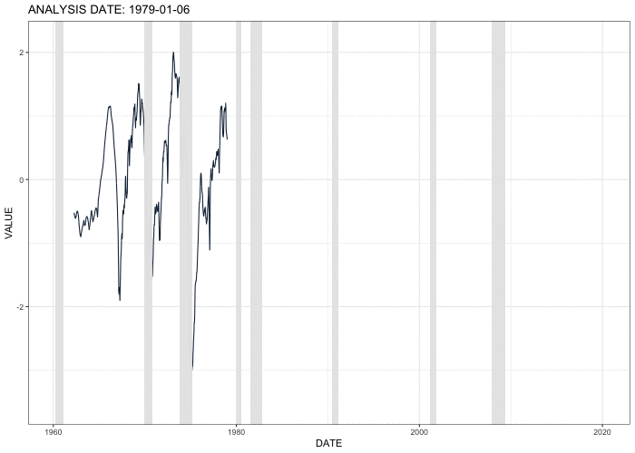

<style>
  .large { font-size: 200% }
  .small { font-size: 50% }
</style>

<style type="text/css">
.remark-slide-content {
    font-size: 21px;
    padding: 1em 1em 1em 1em;
}

.remark-slide-content h1 {
  font-size: 26px;
}

.remark-slide-content h2 {
  font-size: 25px;
}

.remark-slide-content h3 {
  font-size: 24px;
}

h1 {
  font-weight: normal;
  margin-top: -80px;
  margin-left: -00px;
  color: #FAFAFA;
}

</style>


```{r setup, include=FALSE}
options(htmltools.dir.version = FALSE)
library(knitr)
library(tidyverse)
library(plotly)
library(kableExtra)
library(ggplot2)
library(lubridate)
library(dplyr)
library(gganimate)
library(readxl)
library(viridis)
library(viridisLite)
library(transformr)
library(magick)
```


# Nowcasting Business Cycle Phases with High and Mixed Frequency Data
## Introduction 

- The business cycle consists of alternating periods of expansion and recession, which are not explicitly observed

--

- Identification of business cycle turning points generally occurs long after the fact
  - For example, the December 2007 peak of the Great Recession was not announced by the National Bureau of Economic Research (NBER) until December 1, 2008

--

- An active literature has worked to develop statistical techniques to “nowcast” business cycle turning points toward the end of the observable sample period 
  - Chauvet & Piger (2008), Chauvet & Hamilton (2006), Fossati (2016), Giusto & Piger (2017)
  - Uses relatively low frequency data (monthly) to nowcast turning points

--

- My paper is the first to systematically evaluate the ability of high frequency data (daily, weekly) to improve upon the timeliness with which new expansions and recessions can be identified


---
# Nowcasting Business Cycle Phases with High and Mixed Frequency Data
## Methodology

**Step #1: Pseudo Real-Time Dataset**

- Data: 
  - daily yield curve term premium, defined as the difference between daily 10-year and daily 3-month U.S. Treasury yields
  - weekly initial claims for unemployment insurance
  - monthly nonfarm payroll employment
  - quarterly real GDP
  
--

- Pseudo Real-Time Dataset: 
  - From Jan 1, 1979 to April 30, 2020, on every Sunday (called "analysis date", denoted by $T$), I updated the above variables 
  - I stripped each series of a linear and a quadratic trend, and standardized the residuals


---
# Nowcasting Business Cycle Phases with High and Mixed Frequency Data
## Methodology

**Step #2: Dynamic Factor Model at Daily Frequency** 

- Following Aruoba, Diebold, & Scotti (2009), I propose a dynamic factor model at daily frequency 

--

- $x_t$: the underlying real economic activity factor on day $t$, assumed to evolve daily with AR(1) dynamics: 

$$x_t = \rho x_{t-1}+e_t$$

- $y^1_t$: term premium (daily), a stock variable

$$\begin{aligned}
y^1_t &= \begin{cases} \beta_1 x_t + u^1_t & \\
          NA & 
          \end{cases} \\
&= \begin{cases} \beta_1 x_t + \gamma_1 u^1_{t-1}+\zeta_t & y^1_t \text{is observed}\\
    NA & y^1_t \text{is not observed}
    \end{cases}
\end{aligned}$$

???

- **Because the term premium is a stock variable, there are no aggregation issues**

- **$y^1_t$ depends linearly on $x_t$**

- **its persistence is modeled at the daily frequency with a $u_t$ term that follows AR(1) dynamics**

---
# Nowcasting Business Cycle Phases with High and Mixed Frequency Data
## Methodology

**Step #2: Dynamic Factor Model at Daily Frequency** 

- Following Aruoba, Diebold, & Scotti (2009), I propose a dynamic factor model at daily frequency 

--

- $y^2_t$: initial claims for unemployment insurance (weekly), a flow variable

$$y^2_t = \begin{cases} \beta_2 C^W_t + \gamma_2 y_{2, t-7} + u^2_t & y^2_t \text{is observed} \\ NA & y^2_t \text{is not observed} \end{cases}$$

$$C_t^W = \xi_t^W C_{t-1}^W + x_t = \xi_t^W C_{t-1}^W + \rho x_{t-1}+e_t$$

$$\xi^W_t = \begin{cases} 
          0 &  \text{if t is the first day of a week} \\
          1 & \text{otherwise} \end{cases}$$

???

- **Because it is a flow variable reported on every Saturday, $y^2_t$ on Saturday is set to the sum of the previous seven daily values, constructed with a weekly cumulator variable $C^W_t$**

- **To model persistence at the daily frequency, $y^2_t^ is set to depend on its previous observed value**

- Theoretically the persistence can be modeled with multiple lags of the $u_t$ term; however, the number of parameters need to be estimated will be unnecessarily large


---
# Nowcasting Business Cycle Phases with High and Mixed Frequency Data
## Methodology

**Step #2: Dynamic Factor Model at Daily Frequency** 

- Following Aruoba, Diebold, & Scotti (2009), I propose a dynamic factor model at daily frequency 

--

- $y^3_t$: nonfarm payroll employment (monthly), a stock variable

$$y^3_t = \begin{cases} \beta_3 x_t + \gamma_3 y_{3, t-30} + u^3_t & y^3_t \text{is observed} \\
          NA & y^3_t \text{is not observed} \end{cases}$$
   
   
???

- **Because it is a monthly stock variable, the end-of-month value is set to the end-of-month daily value**

- **Persistence is modeled with its previous observed value**


---
# Nowcasting Business Cycle Phases with High and Mixed Frequency Data
## Methodology

**Step #2: Dynamic Factor Model at Daily Frequency** 

- Following Aruoba, Diebold, & Scotti (2009), I propose a dynamic factor model at daily frequency 

--

- $y^4_t$: real GDP (quarterly), a flow variable

$$y^4_t = \begin{cases} \beta_4 C^Q_t + \gamma_4 y_{4, t-90} + u^4_t & y^4_t \text{is observed} \\
          NA & y^4_t \text{is not observed} \end{cases}$$
          
$$C_t^Q = \xi_t^Q C_{t-1}^Q + x_t = \xi_t^Q C_{t-1}^Q + \rho x_{t-1}+e_t$$

$$\xi^Q_t = \begin{cases} 
          0 &  \text{if t is the first day of a quarter} \\
          1 & \text{otherwise} \end{cases}$$

???

- **Because it is a flow variable, the end-of-quarter value is set to the sum of daily values within the quarter with a quarterly cumulator variable $C^Q_t$**

- **Persistence is modeled with its previous observed value**


---
# Nowcasting Business Cycle Phases with High and Mixed Frequency Data
## Methodology

**Step #2: Dynamic Factor Model at Daily Frequency** 

$$\underbrace{\begin{bmatrix} 
    y^1_t \\
    y^2_t \\
    y^3_t \\
    y^4_t
  \end{bmatrix}}_{\boldsymbol{\Upsilon_t}} = 
  \underbrace{\begin{bmatrix} 
    \gamma_1 & \beta_1 & 0 & 0 & 0 \\
    0 & 0 & \beta_2 & 0 & \gamma_2 \times y_{2, t-7} \\
    0 & \beta_3 & 0 & 0 & \gamma_3 \times y_{3,t-30} \\
    0 & 0 & 0 & \beta_4 & \gamma_4 \times y_{4, t-90}
  \end{bmatrix}}_{\boldsymbol{FF_t}} \times 
  \underbrace{\begin{bmatrix} 
    u^1_{t-1} \\
    x_t \\
    C^W_t \\
    C^Q_t \\
    1 
  \end{bmatrix}}_{\boldsymbol{\theta_t}} +
  \underbrace{\begin{bmatrix}
  \zeta_t \\
    u^2_t \\
    u^3_t \\
    u^4_t
  \end{bmatrix}}_{\boldsymbol{\nu_t}}$$
  
$$\underbrace{\begin{bmatrix}
    u^1_{t-1} \\
    x_t \\
    C^W_t \\
    C^Q_t \\
    1
  \end{bmatrix}}_{\boldsymbol{\theta_t}} =
  \underbrace{\begin{bmatrix}
    \gamma_1 & 0 & 0 & 0 & 0 \\
    0 & \rho & 0 & 0 & 0\\
    0 & \rho & \xi^W_t & 0 & 0 \\
    0 & \rho & 0 & \xi^Q_t & 0 \\
    0 & 0 & 0 & 0 & 1
  \end{bmatrix}}_{\boldsymbol{GG_t}} \times
  \underbrace{\begin{bmatrix}
    u^1_{t-2} \\
    x_{t-1} \\
    C^W_{t-1} \\
    C^Q_{t-1} \\
    1
  \end{bmatrix}}_{\boldsymbol{\theta_{t-1}}} +
  \underbrace{\begin{bmatrix}
    \zeta_{t-1} \\
    e_t \\
    e_t \\
    e_t \\
    0
  \end{bmatrix}}_{\boldsymbol{\omega_t}}$$

---
# Nowcasting Business Cycle Phases with High and Mixed Frequency Data
## Methodology

**Step #2: Dynamic Factor Model at Daily Frequency**

- The model can be represented in time-varying state-space form as:

$$\begin{aligned}
\boldsymbol{\Upsilon_t} &= \boldsymbol{FF_t} \times \boldsymbol{\theta_t} + \boldsymbol{\nu_t} \\
\boldsymbol{\theta_t} &= \boldsymbol{GG_t} \times \boldsymbol{\theta_{t-1}} + \boldsymbol{\omega_t} 
\end{aligned}$$

--
     
- I use the Kalman filter to form the likelihood function. Then I estimate paramteres using Maximum Likelihood Estimation with all available data. Then I plug in estimates of parameters into equations and use the Kalman smoother to extract a daily index of real economic activity $\hat{x_t}$

---
# Nowcasting Business Cycle Phases with High and Mixed Frequency Data
## Methodology

???

- **Shaded areas indicate U.S. recessions**

- **The factor drops during recessions**

--

**Step #2: Dynamic Factor Model at Daily Frequency** 




---
# Nowcasting Business Cycle Phases with High and Mixed Frequency Data
## Methodology

**Step #3: Supervised (Markov-switching) Regime Classifications**

- $S_t = 0$: day $t$ is a expansion regime; $S_t =1$: day $t$ is a recession regime

--

- $p_{ji} = Pr(S_t=j|S_{t-1} = i)$

--

- Fitting the first difference of $\hat{x_t}$ to a univariate Markov-switching AR(0) process with a switching mean:

$$\begin{aligned}
\Delta\hat{x_t} &= \beta_{S_t} + \epsilon_t\\
\epsilon_t &\sim N(0, \sigma^2)
\end{aligned}$$

--

- The parameters of the model: $\Omega = (\beta_0, \beta_1, p_{00}, p_{11}, \sigma)'$


---
# Nowcasting Business Cycle Phases with High and Mixed Frequency Data
## Methodology

???

- Because NBER recession and expansion dates are known only with a substantial lag, I do not use the NBER indicator through the end of the relevant sample to estimate parameters at each analysis date. Instead I adopt a conservative approach and estimate model parameters on data ending one year prior to the analysis date

--

**Step #3: Supervised (Markov-switching) Regime Classifications**

- On each analysis date $T$, using non-parametric techniques, I estimate parameters of the model using data up to one year from $T$:
  - Estimating $\beta_0$ and $\beta_1$ as the mean of $\Delta\hat{x_t}$ in each NBER regime
  - Estimating transition probabilities as the mean of transitions using the NBER regimes
  - Estimating variance of the disturbance terms as the residuals of the regression

- Given these estimates, I run the Hamilton smoother through data to the end of $T$ in order to obtain the recession probabilities, denoted $\hat{P}(S_t = 1 |\Psi_T)$
  
  
  
  
---
# Nowcasting Business Cycle Phases with High and Mixed Frequency Data
## Methodology

???

- **In order to convert recession probabilities $\hat{P}(S_t = 1 |\Psi_T)$ into a recession or expansion call, I use a simple procedure**

--

**Step #4: Business Cycle Phases Dating Procedures**

- Identifying a new recession
  - Suppose that the last NBER turning point date that was announced is a business
cycle trough
  - I search for the first analysis date $T$ for which the average value of $\hat{P}(S_t = 1 |\Psi_T)$ over the 12 weeks prior to $T$ exceeds 0.8
  
--

- Identifying a new expansion
  - Suppose that the last NBER turning point date that was announced is a business cycle peak
  - I search for the first analysis date $T$ for which the average value of $\hat{P}(S_t = 1 |\Psi_T)$ over the 12 weeks prior to $T$ is below 0.2

--

- I also produce results for an alternative threshold of 0.9 as a robustness check


---
# Nowcasting Business Cycle Phases with High and Mixed Frequency Data
## Preliminary Results of the Dynamic Factor Markov Switching Model at Daily Frequency (DFMSDF)

???

- **1st: the month that NBER turning points occur**

- **2nd: the starting date of NBER business cycles phases, which is defined as the first date after NBER turning points occur**

- **3rd: dates when turning points are called using DFMSDF, following the proposed simple procedure**

- **4th: the number of lag days in NBER announcements made by the NBER’s Business Cycle Dating Committee**

- **5th: the number of lag days using a learning vector quantization method as in Giusto & Piger (2017)**

- **6th: the number of lag days using the DFMSDF method proposed in this chapter**

- **All of NBER turning points dates in the first column are identified by the DFMSDF method**

- **On average, the DFMSDF method established the business cycle peak 21 days prior to it starts; the DFMSDF method identifies the business cycle trough with an average lead of 11 days. Faster than the other two methods**

- **The NBER has not announced any new recessions since the 2007-2009 Great Recession. However, the DFMSDF method identified a new peak on March 15, 2020. The new recession is identified as the Covid-19 public health crisis started**

--

```{r ch3-table-peak1, echo=FALSE, message=FALSE, warnings=FALSE, results='asis'}
library(dplyr)
library(kableExtra)

options(knitr.kable.NA = '')

peak_table <- data.frame(matrix(ncol = 6, nrow = 7))
colnames(peak_table) <- c("NBER Peak Date", "First Day of Recession", "Date Peak Call Available - DFMSDF", "NBER's Business Cycle Dating Committee Lag", "Giusto & Piger (2017) Lag", "DFMSDF Lag" )

peak_table[1,1] <- c("Jan-1980")
peak_table[2,1] <- c("Jul-1981")
peak_table[3,1] <- c("Jul-1990")
peak_table[4,1] <- c("Mar-2001")
peak_table[5,1] <- c("Dec-2007")
peak_table[6,1] <- c("Average")

peak_table[1,2] <- c("2/1/1980")
peak_table[2,2] <- c("8/1/1981")
peak_table[3,2] <- c("8/1/1990")
peak_table[4,2] <- c("4/1/2001")
peak_table[5,2] <- c("1/1/2008")

peak_table[1,3] <- c("5/11/1980")
peak_table[2,3] <- c("11/1/1981")
peak_table[3,3] <- c("7/29/1990")
peak_table[4,3] <- c("7/2/2000")
peak_table[5,3] <- c("12/9/2007")
peak_table[7,3] <- c("3/15/2020")

peak_table[1,4] <- c("123")
peak_table[2,4] <- c("158")
peak_table[3,4] <- c("267")
peak_table[4,4] <- c("239")
peak_table[5,4] <- c("335")
peak_table[6,4] <- c("224")

peak_table[1,5] <- c("92")
peak_table[2,5] <- c("126")
peak_table[3,5] <- c("78")
peak_table[4,5] <- c("216")
peak_table[5,5] <- c("158")
peak_table[6,5] <- c("134")

peak_table[1,6] <- c("100")
peak_table[2,6] <- c("92")
peak_table[3,6] <- c("-3")
peak_table[4,6] <- c("-273")
peak_table[5,6] <- c("-23")
peak_table[6,6] <- c("-21")

kable(peak_table, booktabs = T) %>%
  kable_styling(full_width = F, font_size = 12, position = "center", latex_options = "hold_position") %>%
  column_spec(3:4, width = "10em") %>%
  column_spec(5, width = "8em") %>%
  column_spec(6, width = "6em") %>%
  column_spec(1:2, width = "6em") %>%
  row_spec(6, bold = T) 
```

```{r ch3-table-trough1, echo=FALSE, message=FALSE, warnings=FALSE, results='asis'}
options(knitr.kable.NA = '')

trough_table <- data.frame(matrix(ncol = 6, nrow = 6))
colnames(trough_table) <- c("NBER Trough Date", "First Day of Expansion", "Date Trough Call Available - DFMSDF", "NBER's Business Cycle Dating Committee Lag", "Giusto & Piger (2017) Lag", "DFMSDF Lag")

trough_table[1,1] <- c("Jul-1980")
trough_table[2,1] <- c("Nov-1982")
trough_table[3,1] <- c("Mar-1991")
trough_table[4,1] <- c("Nov-2001")
trough_table[5,1] <- c("Jun-2009")
trough_table[6,1] <- c("Average")

trough_table[1,2] <- c("8/1/1980")
trough_table[2,2] <- c("12/1/1982")
trough_table[3,2] <- c("4/1/1991")
trough_table[4,2] <- c("12/1/2001")
trough_table[5,2] <- c("7/1/2009")

trough_table[1,3] <- c("8/10/1980")
trough_table[2,3] <- c("12/12/1982")
trough_table[3,3] <- c("6/2/1991")
trough_table[4,3] <- c("8/19/2001")
trough_table[5,3] <- c("5/31/2009")

trough_table[1,4] <- c("341")
trough_table[2,4] <- c("219")
trough_table[3,4] <- c("631")
trough_table[4,4] <- c("593")
trough_table[5,4] <- c("446")
trough_table[6,4] <- c("446")

trough_table[1,5] <- c("127")
trough_table[2,5] <- c("136")
trough_table[3,5] <- c("443")
trough_table[4,5] <- c("308")
trough_table[5,5] <- c("157")
trough_table[6,5] <- c("234")

trough_table[1,6] <- c("9")
trough_table[2,6] <- c("11")
trough_table[3,6] <- c("62")
trough_table[4,6] <- c("-104")
trough_table[5,6] <- c("-31")
trough_table[6,6] <- c("-11")

kable(trough_table, booktabs = T) %>%
  kable_styling(full_width = F, font_size = 12, position = "center", latex_options = "hold_position") %>%
  column_spec(3:4, width = "10em") %>%
  column_spec(5, width = "8em") %>%
  column_spec(6, width = "6em") %>%
  column_spec(1:2, width = "6em") %>%
  row_spec(6, bold = T) 
```


---
# Nowcasting Business Cycle Phases with High and Mixed Frequency Data
## Preliminary Baseline Results

- False Recessions and False Expansions Identified in Real-time (Threshold=0.8):

```{r ch3-table-false1, echo=FALSE, message=FALSE, warnings=FALSE, results='asis'}
options(knitr.kable.NA = '')

false_table <- data.frame(matrix(ncol = 2, nrow = 6))
colnames(false_table) <- c("False Recessions", "False Expansions")

false_table[1,1] <- c("2/16/1979-12/30/1979")
false_table[2,1] <- c("10/7/1984-11/11/1984")
false_table[3,1] <- c("1/24/1988-2/7/1988")
false_table[4,1] <- c("7/9/1989-8/6/1989")
false_table[5,1] <- c("4/23/1995-6/18/1995")
false_table[6,1] <- c("4/13/2003-5/4/2003")

false_table[1,2] <- c("2/28/1982-3/14/1982")

kable(false_table, booktabs = T) %>%
  kable_styling(full_width = F, font_size = 12, position = "center", latex_options = "hold_position") 
```

- These are all short in that they only send a false signal for a few weeks

- In future work I plan to incorporate additional series into the analysis to reduce the number of false recessions and expansions 


---
# Nowcasting Business Cycle Phases with High and Mixed Frequency Data
## Future Directions

**A broader vintage real-time dataset**:
- Modifying the method to incorporate additional series, such as the unemployment rate, industrial production, and real manufacturing and trade sales
- The current data set incorporates data revisions, since it was obtained in April 2020
  - I plan to compile the vintage data into a real-time dataset that would have been available on each day
  - By using the vintage real-time dataset, I search for new business phases turning points as if I were an analyst each day beginning on Jan 1, 1979

--

**A broader variety of supervised regime classifications**:
- I plan to train a variety of supervised machine learning classification techniques
  - the Naive Bayes classifier, the k-nearest neighbor classifier, learning vector quantization, random forest, and boosting

