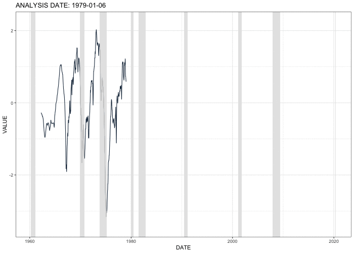
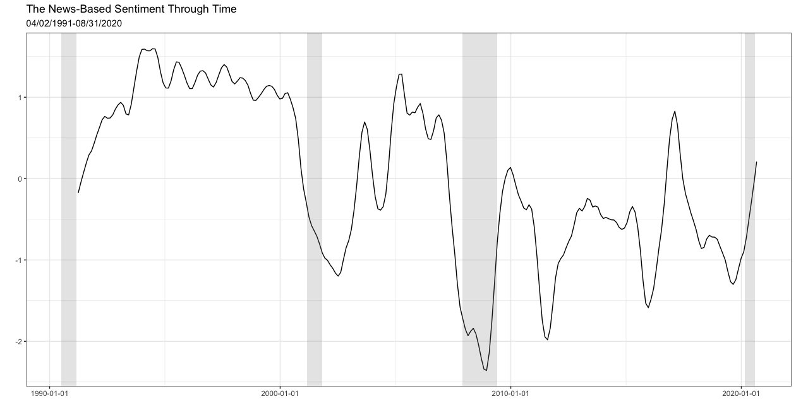
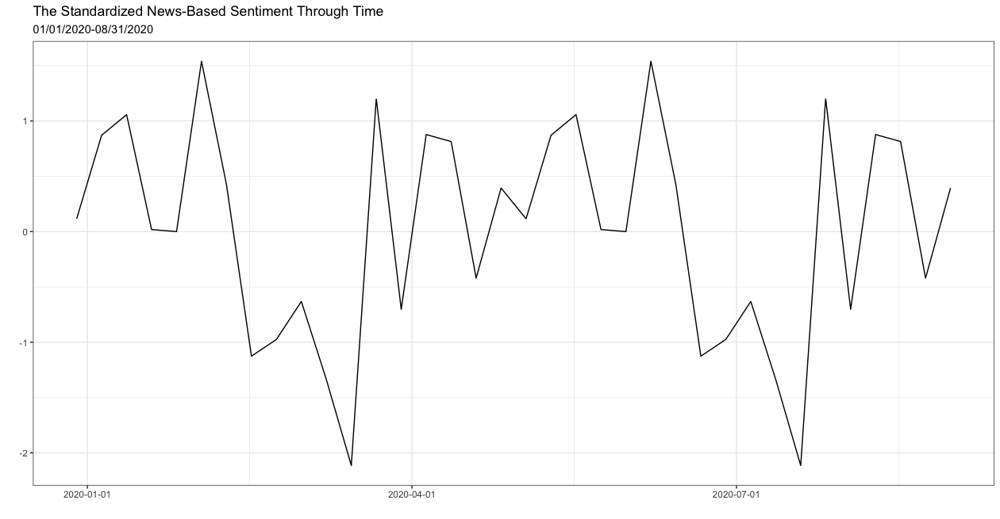

```{r setup, include=FALSE}
options(htmltools.dir.version = FALSE)
library(knitr)
library(tidyverse)
library(plotly)
library(kableExtra)
library(ggplot2)
library(lubridate)
library(dplyr)
library(gganimate)
library(readxl)
library(viridis)
library(viridisLite)
library(transformr)
library(magick)
library(htmlTable)
library(scales)
```


# Introduction 

- Timely identification of expansions and recessions is of substantial interest to real-time economic decision makers, including firms, policymakers, and individual consumers

--

- To identify a recession _before_ it occurs: 
  - **forecasting** of business cycle turning points

--

- A large literature has attempted to forecast recessions with only very limited success
  - Berge (2015), Chauvet & Potter (2005), Kauppi & Saikkonen (2008), Ng (2014), and Rudebusch & Williams (2009)
  
--

- This leaves us trying to identify new recessions and expansions in _a window of time just prior to or, often, after_ the turning point occurs：
  - **nowcasting** of business cycle turning points


???

- There are lots of papers in this **forecasting** literature, and many of them find that the most successful variable for forecasting recessions is the Treasury yield spread. 

- it is widely recognized that Many examples of recessions were not predicted with any substantial lead time

- **nowcasting of business cycle turning points**: to produce dates of new business cycle turning points in real time

- If a recession has already started, it's better to know now rather than later
  
- Such an endeavor, which is commonly called “nowcasting” of business cycle turning points, has received significant recent attention in the literature


---
# Introduction

- For the United States, one source of **nowcasts** is provided by the National Bureau of Economic Research (NBER)

- However, their calls of new turning points often occur long after the fact
  - The 2007-2009 Great Recession
  - The 2020 recession amid the Covid-19 pandemic

--

- As shown by Chauvet & Piger (2008) and Chauvet & Hamilton (2006), statistical models are able to improve significantly on the speed of detection of new turning points over the NBER


- However, these models still produce new turning points with a substantial lag time
  - Hamilton (2011) 
  
  
???

- The 2007-2009 Great Recession was not announced until December 1, 2008.
  
- The recession which started in March 2020 was not announced by the NBER until 3 months later 

- the NBER’s goal is to provide an accurate historical record of turning points, not speed of detection, and as a result their calls of new turning points often occur long after the fact

- Hamilton (2011): surveys a range of statistical models in use during 2008 and finds they would not have identified the December 2007 peak in economic activity until late 2008
  


---
# Introduction 

- This is because nearly all of the literature studying the nowcast of U.S. business cycle phases uses **coincident** data at relatively **low frequencies** 

--

- My paper systematically explores whether the use of **high-frequency** data, **leading** data, and **information from news articles** can improve the speed at which expansions and recessions are identified over the existing literature


???

- namely monthly or quarterly data that moves contemporaneoulsy with changes in overall economic activity.

- In other words, during periods of economic expansion, the coincident data increases; when the economy contracts, the data falls.

- It seems reasonable to expect that significant gains in the speed might be achieved by also incorporating higher frequency data at the daily or weekly frequency.

- First, higher frequency data would allow additional variables to be incorporated than what has typically been used in literature, such as financial market variables or initial claims of unemployment insurance.

- Second, the use of higher frequency data would allow for more frequent updating of the model

- Third, higher frequency variables generally have much shorter reporting lags. initial claims on unemployment insurance for a given week are available only a few days after the week ends, whereas many monthly series, such as personal income, are released only after a full month delay.


---
# Contribution

- In my paper I contribute in three primary ways to the literature studying nowcasting of U.S. business cycle turning points

--

- First, I study whether the use of _higher frequency data_ can improve the speed at which business cycle peaks and troughs post 1980 can be identified in U.S. data over the existing literature that focuses primarily on _low frequency data_

--

- Second, I incorporate a mix of both _leading variables_ and _coincident variables_ for the purpose of nowcasting business cycle turning points


--

- Third, I evaluate the ability of a new daily news-based index of economic sentiment for nowcasting business cycle turning points


???

- The existing literature focused on forecasting turning points has used only leading variables, while the literature focused on nowcasting turning points has used only coincident variables. Here I use a dataset containing a number of standard coincident variables, which ensures that the model will be able to eventually capture new business cycle turning points. However, I also use a leading variable in the analysis, namely a yield curve premium, which has been shown to have significant forecasting power for recessions. This leading variable can help reinforce signals coming from coincident variables in the time periods prior to and after recessions begin, and thus potentially speed up the identification of new business cycle turning points

- Unlike most of the headline macroeconomic data that are published at a relatively low frequency and for which past observation periods are revised as more accurate estimates become available, text such as news articles arrives daily and is not revised. These advantages make data extracted from text an ideal candidate to nowcast business cycle turning points


---
# Main Findings

- I find that implementing these three additions - high-frequency data, leading data, and information from news articles - significantly and consistently improves the speed at which expansions and recessions can be identified in the United States since 1980

--

- As an example, incorporating high-frequency and leading data produces a call of the December 2007 business cycle peak on March 30, 2008
  - When I further incorporate information from the news, my model identifies the December 2007 business cycle peak even earlier, on December 2, 2007


???

- This is 246 days ahead of the NBER announcement, and many months ahead of the statistical procedures surveyed in Hamilton (2011)


---
# Methodology

**Step #1: Constructing a Real-Time Dataset for Each Analysis Date**

- Every Sunday starting from Jan 1, 1979 to August 31, 2020 is my **analysis date** to conduct the nowcasting exercise

  - The plot shows the first and the last analysis date, as well as some analysis dates in between
  
```{r , echo=FALSE, message=FALSE, warning=FALSE, results='asis', fig.width=8.5, out.width = "100%"}
knitr::include_graphics(c("/Users/lixiang/Desktop/resume/website/lx0413.github.io/files/Timeline2.png"))
```


---
# Methodology

**Step #1: Constructing a Real-Time Dataset for Each Analysis Date**

- Economic data for past observation periods are revised as more accurate estimates become available

--

- For example, the value of the initial claims for unemployment insurance (ICSA) on May 23, 2009 downloaded from the Federal Reserve Economic Data (FRED) database on August 31, 2020 is 606,000, which is not available for a researcher on May 28, 2009

```{r ch3-table-timeline, echo=FALSE, message=FALSE, warning=FALSE, results='asis'}
library(dplyr)
library(kableExtra)

options(knitr.kable.NA = '')

timeline_table1 <- data.frame(matrix(ncol = 7, nrow =2 ))
colnames(timeline_table1) <- c("Announcement", rep("Revision", times=6))
row.names(timeline_table1) <- c("Date", "Value")

timeline_table1 [1,1] <- c("2009-05-28")
timeline_table1 [1,2] <- c("2009-06-04")
timeline_table1 [1,3] <- c("2010-03-25")
timeline_table1 [1,4] <- c("2011-03-31")
timeline_table1 [1,5] <- c("2012-03-29")
timeline_table1 [1,6] <- c("2013-03-28")
timeline_table1 [1,7] <- c("2014-04-03")

timeline_table1 [2,1] <- c(623000)
timeline_table1 [2,2] <- c(625000)
timeline_table1 [2,3] <- c(611000)
timeline_table1 [2,4] <- c(612000)
timeline_table1 [2,5] <- c(608000)
timeline_table1 [2,6] <- c(607000)
timeline_table1 [2,7] <- c(606000)

kable(timeline_table1, booktabs = T) %>%
  kable_styling(full_width = T, font_size = 12, position = "center")
```

--

- I use the latest revised data available on each analysis date of the following series: 
  - Daily yield curve term premium, defined as the difference between daily 10-year and daily 3-month U.S. Treasury yields 
  - Weekly initial claims for unemployment insurance
  - Monthly nonfarm payroll employment
  - Quarterly real GDP

???

- Then I stripped each series of a linear and a quadratic trend, and standardized the residuals


---
# Methodology

**Step #2: Extracting the Underlying Economic Activity Using a Mixed-frequency Dynamic Factor Model** 

- Here I lay out the model proposed in Aruoba, Diebold, & Scotti (2009) to extract $x_t$, which is the underlying real economic activity factor on day $t$

--

- $x_t$: assumed to evolve daily with AR(1) dynamics: 

$$x_t = \rho x_{t-1}+e_t$$

- $y^1_t$: yield curve term premium (daily), a stock variable

$$\begin{aligned}
y^1_t &= \begin{cases} \beta_1 x_t + u^1_t & \\
          NA & 
          \end{cases} \\
&= \begin{cases} \beta_1 x_t + \gamma_1 u^1_{t-1}+\zeta_t & y^1_t \text{is observed}\\
    NA & y^1_t \text{is not observed}
    \end{cases}
\end{aligned}$$

???

- $e_t$ is a white noise innovation 

- **Because the term premium is a stock variable, there are no aggregation issues**

- $y^1_t$ depends linearly on $x_t$

- Because $y^1_t$  is reported every weekday, persistence of it is modeled at the daily frequency with a $u_t$ term that follows AR(1) dynamics


---
# Methodology

**Step #2: Extracting the Underlying Economic Activity Using a Mixed-frequency Dynamic Factor Model** 

- $y^2_t$: initial claims for unemployment insurance (weekly), a flow variable

$$y^2_t = \begin{cases} \beta_2 C^W_t + \gamma_2 y_{2, t-7} + u^2_t & y^2_t \text{is observed} \\ NA & y^2_t \text{is not observed} \end{cases}$$

$$C_t^W = \xi_t^W C_{t-1}^W + x_t = \xi_t^W C_{t-1}^W + \rho x_{t-1}+e_t$$

$$\xi^W_t = \begin{cases} 
          0 &  \text{if t is the first day of a week} \\
          1 & \text{otherwise} \end{cases}$$

???

- **Because $y^2_t$ is a flow variable reported on every Saturday, $y^2_t$ on Saturday is set to the sum of the previous seven daily values, constructed with a weekly cumulator variable $C^W_t$**

- **To model persistence at the daily frequency, $y^2_t^ is set to depend on its previous observed value $y_{2, t-7}$**

- Theoretically the persistence can be modeled with multiple lags of the $u_t$ term; however, the number of parameters need to be estimated will be unnecessarily large


---
# Methodology

**Step #2: Extracting the Underlying Economic Activity Using a Mixed-frequency Dynamic Factor Model** 

- $y^3_t$: nonfarm payroll employment (monthly), a stock variable

$$y^3_t = \begin{cases} \beta_3 x_t + \gamma_3 y_{3, t-30} + u^3_t & y^3_t \text{is observed} \\
          NA & y^3_t \text{is not observed} \end{cases}$$
   
   
???

- **Because it is a monthly stock variable, the end-of-month value is set to the end-of-month daily value**

- **Persistence is modeled with its previous observed value**


---
# Methodology

**Step #2: Extracting the Underlying Economic Activity Using a Mixed-frequency Dynamic Factor Model** 

- $y^4_t$: real GDP (quarterly), a flow variable

$$y^4_t = \begin{cases} \beta_4 C^Q_t + \gamma_4 y_{4, t-90} + u^4_t & y^4_t \text{is observed} \\
          NA & y^4_t \text{is not observed} \end{cases}$$
          
$$C_t^Q = \xi_t^Q C_{t-1}^Q + x_t = \xi_t^Q C_{t-1}^Q + \rho x_{t-1}+e_t$$

$$\xi^Q_t = \begin{cases} 
          0 &  \text{if t is the first day of a quarter} \\
          1 & \text{otherwise} \end{cases}$$

???

- **Because $y^4_t$ is a flow variable, the end-of-quarter value is set to the sum of daily values within the quarter with a quarterly cumulator variable $C^Q_t$**

- **Persistence is modeled with its previous observed value**

---
# Methodology

**Step #2: Extracting the Underlying Economic Activity Using a Mixed-frequency Dynamic Factor Model** 

$$\underbrace{\begin{bmatrix} 
    y^1_t \\
    y^2_t \\
    y^3_t \\
    y^4_t
  \end{bmatrix}}_{\boldsymbol{\Upsilon_t}} = 
  \underbrace{\begin{bmatrix} 
    \gamma_1 & \beta_1 & 0 & 0 & 0 \\
    0 & 0 & \beta_2 & 0 & \gamma_2 \times y_{2, t-7} \\
    0 & \beta_3 & 0 & 0 & \gamma_3 \times y_{3,t-30} \\
    0 & 0 & 0 & \beta_4 & \gamma_4 \times y_{4, t-90}
  \end{bmatrix}}_{\boldsymbol{FF_t}} \times 
  \underbrace{\begin{bmatrix} 
    u^1_{t-1} \\
    x_t \\
    C^W_t \\
    C^Q_t \\
    1 
  \end{bmatrix}}_{\boldsymbol{\theta_t}} +
  \underbrace{\begin{bmatrix}
  \zeta_t \\
    u^2_t \\
    u^3_t \\
    u^4_t
  \end{bmatrix}}_{\boldsymbol{\nu_t}}$$
  
$$\underbrace{\begin{bmatrix}
    u^1_{t-1} \\
    x_t \\
    C^W_t \\
    C^Q_t \\
    1
  \end{bmatrix}}_{\boldsymbol{\theta_t}} =
  \underbrace{\begin{bmatrix}
    \gamma_1 & 0 & 0 & 0 & 0 \\
    0 & \rho & 0 & 0 & 0\\
    0 & \rho & \xi^W_t & 0 & 0 \\
    0 & \rho & 0 & \xi^Q_t & 0 \\
    0 & 0 & 0 & 0 & 1
  \end{bmatrix}}_{\boldsymbol{GG_t}} \times
  \underbrace{\begin{bmatrix}
    u^1_{t-2} \\
    x_{t-1} \\
    C^W_{t-1} \\
    C^Q_{t-1} \\
    1
  \end{bmatrix}}_{\boldsymbol{\theta_{t-1}}} +
  \underbrace{\begin{bmatrix}
    \zeta_{t-1} \\
    e_t \\
    e_t \\
    e_t \\
    0
  \end{bmatrix}}_{\boldsymbol{\omega_t}}$$


???

- The initial claims for unemployment insurance, nonfarm payroll employment and real GDP are coincident data that move with business cycle phases at the same time, whereas the yield curve term premium is a leading data that moves before business cycle phases

- The dynamic factor model at daily frequency is cast using **a measurement equation and a transition equation**

---
# Methodology

**Step #2: Extracting the Underlying Economic Activity Using a Mixed-frequency Dynamic Factor Model** 

- The model can be represented in time-varying state-space form

$$\underbrace{\begin{bmatrix}
    \zeta_t \\
    u^2_t \\
    u^3_t \\
    u^4_t\\
  \end{bmatrix}}_{\boldsymbol{\nu_t}} \sim
  N \Bigg( \begin{bmatrix} 0 \\ 0\\ 0\\ 0\\ \end{bmatrix}, 
  \underbrace{\begin{bmatrix} {\sigma_1}^2 & 0 & 0 & 0 \\ 0 & 7 \times {\sigma_2}^2 & 0 & 0 \\
0 &  0 & {\sigma_3}^2 & 0 \\ 0 & 0 & 0 & 90 \times {\sigma_4}^2 \end{bmatrix} \Bigg)}_{\boldsymbol{V_t}}$$

$$\underbrace{\begin{bmatrix}
    \zeta_{t-1} \\
    e_t \\
    e_t \\
    e_t \\
    0
  \end{bmatrix}}_{\boldsymbol{\omega_t}} \sim
  N \Bigg( \begin{bmatrix} 0 \\ 0\\ 0\\ 0\\ 0\\ \end{bmatrix}, 
  \underbrace{\begin{bmatrix} {\sigma_1}^2 & 0 & 0 & 0 & 0\\ 0 & 1-\rho^2 & 0 & 0 & 0 \\
0 &  0 & 1-\rho^2 & 0 & 0 \\ 0 & 0 & 0 & 1-\rho^2&0 \\ 0 & 0 & 0 & 0 & 0 \end{bmatrix} \Bigg)}_{\boldsymbol{W_t}}$$


---
# Methodology

**Step #2: Extracting the Underlying Economic Activity Using a Mixed-frequency Dynamic Factor Model** 

- The model can be represented in time-varying state-space form as:

$$\begin{aligned}
\boldsymbol{\Upsilon_t} &= \boldsymbol{FF_t} \times \boldsymbol{\theta_t} + \boldsymbol{\nu_t} \\
\boldsymbol{\theta_t} &= \boldsymbol{GG_t} \times \boldsymbol{\theta_{t-1}} + \boldsymbol{\omega_t} 
\end{aligned}$$

--
     
- Following ADS, I use the Kalman filter and smoother to obtain optimal extractions of the latent state of real economic activity $\hat{x_t}$. 
  - At each analysis date, parameters are re-estimated. 
  - As is standard for classical estimation, I initialize the Kalman filter using the unconditional mean and covariance matrix of the state vector. 
  - Parameters are estimated with maximum likelihood methods


---
# Methodology

**Step #2: Extracting the Underlying Economic Activity Using a Mixed-frequency Dynamic Factor Model**




???

- As the example, estimated factor estimated on some of the analysis dates between 1979 and 2020 are shown 

- Shaded areas indicate U.S. recessions. 

- The factor drops during recessions and drops before recessions in some cases. 


---
# Methodology

**Step #3: Train a Supervised Markov Regime-Switching Model to Classify the Underlying Economic Activity into Recession and Expansion Regimes**

- Fitting the first difference of $\hat{x_t}$ to a univariate Markov-switching $AR(0)$ process with a switching mean:

$$\begin{align}
\Delta\hat{x_t} &= \beta_{S_t} + \epsilon_t\\
\epsilon_t &\sim N(0, \sigma^2) \\
\beta_{S_t} &= \beta_0 + \beta_1 \times S_t \\
\beta_1 &<0
\end{align}$$

--

- $S_t = 0$: day $t$ is an expansion regime; $S_t =1$: day $t$ is a recession regime

--

- When $S_t$ switches from regime 0 to 1, the mean growth rate of economic activity switches by $\beta_1$

--

- $p_{ji} = Pr(S_t=j|S_{t-1} = i)$: the transition probability of $S_t$ switching from regime $i$ to regime $j$.

--

- The parameters of the model: $\Omega = (\beta_0, \beta_1, p_{11}, p_{22}, \sigma)'$


???

- In this case, supervised classification techniques require NBER turning point
dates to be known. The NBER turning point dates are therefore taken as given that it correctly classify the unobservable state of the economy into either regime.

- $\beta_1 <0$ ensures that the mean growth rate of economic activity declines switching from an expansion regime to a a recession regime


---
# Methodology

**Step #3: Train a Supervised Markov Regime-Switching Model to Classify the Underlying Economic Activity into Recession and Expansion Regimes**

- On each analysis date $T$, using non-parametric techniques, I estimate parameters of the model using data up to one year from $T$
  - Estimating $\beta_0$ and $\beta_1$ as the mean of $\Delta\hat{x_t}$ in each NBER regime
  - Estimating transition probabilities as the mean of transitions using the NBER regimes
  - Estimating variance of the disturbance terms as the residuals of the regression

--

- Given these estimates, I run the Hamilton smoother through data to the end of $T$ in order to obtain the recession probabilities, denoted $\hat{P}(S_t = 1 |\Psi_T)$

```{r , echo=FALSE, message=FALSE, warning=FALSE, results='asis', fig.width=8.5, out.width = "100%"}
knitr::include_graphics(c("/Users/lixiang/Desktop/resume/website/lx0413.github.io/files/Timeline3.png"))
```

???

- Because NBER recession and expansion dates are known only with a substantial lag, I adopt a conservative approach and estimate model parameters on data ending one year prior to the analysis date

- The blue bar represents the set on which the parameters are estimated. The yellow bar represents the seton which the regime is predicted using the Hamilton filter.

- I have trained a variety of supervised classification techniques, including the k-nearest neighbor classifier, the random forest classifier, and the Naive Bayes classifier. However, these classifiers failed to identify a large number of recessions, and overall their performance was dominated by the Markov regime-switching classifier. 

- One explanation for the poor performance of these classifiers is that they do not have a mechanism to capture the very high level of persistence of the daily regime variable, the NBER indicator $S_t$

- At a daily frequency, the estimated values of $P_{11}$ and $P_{22}$ are very high, 0.99962 and 0.99723. The Markov regime-switching based classifier captures this persistence by modeling $S_t$ as following a Markov process.


---
# Methodology

**Step #4: Propose a Business Cycle Phases Dating Procedure**

- To identify a new recession
  - If the last NBER turning point date that was announced is a business cycle trough, I search for all analysis dates $T$ for which the average value of $\hat{P}(S_t = 1 |\Psi_T)$ over the 12 weeks prior to $T$ exceeds 0.8
  - The first of these analysis dates is considered a recession "call"

- To identify a new expansion
  - If the last NBER turning point date that was announced is a business cycle peak, I search for analysis dates for which the average value of $\hat{P}(S_t = 1 |\Psi_T)$ over the 12 weeks prior to $T$ is below 0.2
  - The first of these analysis dates is consider an expansion "call"

???

- In order to convert recession probabilities $\hat{P}(S_t = 1 |\Psi_T)$ into a recession or expansion call, I propose a simple procedure

- This procedure mirrors that in Chauvet & Piger (2008) for monthly data. Having elements of my model specification be consistent with existing literature is useful to compare my results to this literature. 

- I also produce results for an alternative threshold of 0.9 as a robustness check.


---
# Baseline Results


```{r ch3-table-peak1, echo=FALSE, message=FALSE, warnings=FALSE, results='asis'}
options(knitr.kable.NA = '')

peak_table <- data.frame(matrix(ncol = 6, nrow = 6))
colnames(peak_table) <- c("Peak as determined by NBER", "First Day of Recession", "Date algorithm made declaration", "Algorithm declaration lead (-) or lag (+) in days", "NBER declaration lead (-) or lag (+) in days", "Giusto & Piger (2017) declaration lead (-) or lag (+) in days")

peak_table[1,1] <- c("Jan-1980")
peak_table[2,1] <- c("Jul-1981")
peak_table[3,1] <- c("Jul-1990")
peak_table[4,1] <- c("Mar-2001")
peak_table[5,1] <- c("Dec-2007")
peak_table[6,1] <- c("Mar-2020")


peak_table[1,2] <- c("2/1/1980")
peak_table[2,2] <- c("8/1/1981")
peak_table[3,2] <- c("8/1/1990")
peak_table[4,2] <- c("4/1/2001")
peak_table[5,2] <- c("1/1/2008")
peak_table[6,2] <- c("3/1/2020")

peak_table[1,3] <- c("4/27/1980")
peak_table[2,3] <- c("11/1/1981")
peak_table[3,3] <- c("8/12/1990")
peak_table[4,3] <- c("7/2/2000")
peak_table[5,3] <- c("3/30/2008")
peak_table[6,3] <- c("3/22/2020")

peak_table[1,4] <- c(86)
peak_table[2,4] <- c(92)
peak_table[3,4] <- c(11)
peak_table[4,4] <- c(-273)
peak_table[5,4] <- c(89)
peak_table[6,4] <- c(21)

peak_table[1,5] <- c(123)
peak_table[2,5] <- c(158)
peak_table[3,5] <- c(267)
peak_table[4,5] <- c(239)
peak_table[5,5] <- c(335)
peak_table[6,5] <- c(99)

peak_table[1,6] <- c(92)
peak_table[2,6] <- c(126)
peak_table[3,6] <- c(78)
peak_table[4,6] <- c(216)
peak_table[5,6] <- c(158)
peak_table[6,6] <- c("Not Applicable")

kable(peak_table, booktabs = T, align = "c") %>%
  kable_styling(full_width = F, font_size = 12, position = "center", latex_options = "hold_position") %>%
  column_spec(3:4, width = "6em", bold = T) %>%
  column_spec(5, width = "6em") %>%
  column_spec(6, width = "6em") %>%
  column_spec(1:2, width = "6em")
```


- All of NBER turning points dates in the first column are identified by my method in the third column.

- My method is fast in identifying NBER turning points dates. The fourth columns shows that the calls made by the DFMSDF approach are quicker than the NBER and Giusto & Piger (2017)

???

- 1st: the month that NBER turning points occur

- 2nd: the starting date of NBER business cycles phases, which is defined as the first date after NBER turning points occur

- 3rd: dates when turning points are called using DFMSDF, following the proposed simple procedure

- 4th: the number of lag days using the DFMSDF method proposed in this paper

- 5th: the number of lag days in NBER announcements made by the NBER’s Business Cycle Dating Committee

- 6th: the number of lag days using a learning vector quantization method as in Giusto & Piger (2017)

- **During the Covid-19 pandemic crisis, the NBER announced on June 8, 2020, that a new recession started in the U.S. in March 2020. The DFMSDF model identified the start of this recession on March 22, 2020, 78 days ahead of the NBER announcement.**

- **my model identifies the start of the Great Recession 256 days ahead of the NBER announcement**


---
# Baseline Results

```{r ch3-table-trough1, echo=FALSE, message=FALSE, warnings=FALSE, results='asis'}
options(knitr.kable.NA = '')

trough_table <- data.frame(matrix(ncol = 6, nrow = 6))
colnames(trough_table) <- c("Trough as determined by NBER", "First Day of Expansion", "Date algorithm made declaration", "Algorithm declaration lead (-) or lag (+) in days", "NBER declaration lead (-) or lag (+) in days", "Giusto & Piger (2017) declaration lead (-) or lag (+) in daysg")

trough_table[1,1] <- c("Jul-1980")
trough_table[2,1] <- c("Nov-1982")
trough_table[3,1] <- c("Mar-1991")
trough_table[4,1] <- c("Nov-2001")
trough_table[5,1] <- c("Jun-2009")

trough_table[1,2] <- c("8/1/1980")
trough_table[2,2] <- c("12/1/1982")
trough_table[3,2] <- c("4/1/1991")
trough_table[4,2] <- c("12/1/2001")
trough_table[5,2] <- c("7/1/2009")

trough_table[1,3] <- c("8/10/1980")
trough_table[2,3] <- c("11/28/1982")
trough_table[3,3] <- c("6/2/1991")
trough_table[4,3] <- c("8/19/2001")
trough_table[5,3] <- c("5/24/2009")
trough_table[6,3] <- c("6/14/2020")

trough_table[1,4] <- c(9)
trough_table[2,4] <- c(-3)
trough_table[3,4] <- c(62)
trough_table[4,4] <- c(-104)
trough_table[5,4] <- c(-38)


trough_table[1,5] <- c(341)
trough_table[2,5] <- c(219)
trough_table[3,5] <- c(631)
trough_table[4,5] <- c(593)
trough_table[5,5] <- c(446)
trough_table[6,5] <- c("Not Applicable")

trough_table[1,6] <- c(127)
trough_table[2,6] <- c(136)
trough_table[3,6] <- c(443)
trough_table[4,6] <- c(308)
trough_table[5,6] <- c(157)
trough_table[6,6] <- c("Not Applicable")

kable(trough_table, booktabs = T, align = "c") %>%
  kable_styling(full_width = F, font_size = 12, position = "center", latex_options = "hold_position") %>%
  column_spec(3:4, width = "6em", bold = T) %>%
  column_spec(5, width = "6em") %>%
  column_spec(6, width = "6em") %>%
  column_spec(1:2, width = "6em")
```


???

- In some cases, my method identifies business cycle phases prior to their starting dates.   
  - March 2001 peak, November 1982 trough, November 2001 trough, June 2009 trough

- This striking result shows that the DFMSDF algorithm not only nowcasts recessions and expansions in a timely manner, but might also be powerful in forecasting recessions and expansions. 

- This striking result shows the value-added for some turning points of incorporating leading data in concert with coincident data in the analysis, as the existing nowcasting literature based only on coincident data does not detect new turning points until after they occur. On the other hand, for the other turning points, the coincident data allows the model to still detect the business cycle turning point relatively quickly after the recession begins. Thus, it seems valuable to incorporate both leading and
coincident data for nowcasting turning points.

- **While a new expansion has not been classified by the NBER, the DFMSDF model identified the end of this recession and the beginning of a new expansion on June 14, 2020, as most of the states have reopened since May.**


---
# Baseline Results

- False Recessions and False Expansions Identified in Real-time: 

```{r ch3-table-false1, echo=FALSE, message=FALSE, warnings=FALSE, results='asis'}
options(knitr.kable.NA = '')

false_table <- data.frame(matrix(ncol = 4, nrow = 7))
colnames(false_table) <- c("False Recessions","Duration", "False Expansions", "Duration")

false_table[1,1] <- c("10/7/1984 - 11/11/1984")
false_table[1,2] <- c("6 weeks")

false_table[2,1] <- c("5/4/1986 - 5/18/1986")
false_table[2,2] <- c("3 weeks")

false_table[3,1] <- c("1/24/1988 - 2/7/1988")
false_table[3,2] <- c("3 weeks")

false_table[4,1] <- c("7/9/1989 - 8/6/1989")
false_table[4,2] <- c("5 weeks")

false_table[5,1] <- c("4/23/1995 - 6/18/1995")
false_table[5,2] <- c("9 weeks")

false_table[6,1] <- c("4/13/2003 - 5/4/2003")
false_table[6,2] <- c("4 weeks")

false_table[7,1] <- c("5/14/2006 - 5/21/2006")
false_table[7,2] <- c("2 weeks")

false_table[1,3] <- c("2/21/1982 - 7/25/1982")
false_table[1,4] <- c("23 weeks")

false_table[2,3] <- c("6/15/2008 - 7/6/2008")
false_table[2,4] <- c("4 weeks")

false_table[3,3] <- c("7/27/2008 - 8/17/2008")
false_table[3,4] <- c("4 weeks")

kable(false_table, booktabs = T) %>%
  kable_styling(full_width = T, font_size = 12, position = "center") 
```

- The procedure based on daily data produces several false positives and false negatives

- Most of these signals were only produced for a relatively short amount of time

???

- This improvement in speed is not entirely without drawbacks however, in that the procedure based on daily data produces several false positives and false negatives,
whereas the Giusto & Piger (2017) method based on only monthly data, and using a similar threshold, did not produce any false recessions or expansions.

- While these false signals should be acknowledged, it is also true that most of these signals were only produced for a relatively short amount of time, with six of the 10 signals lasting for four weeks or less. 

- As macroeconomic policy takes time to be implemented, it is unlikely that policy mistakes predicated on these signals would have been large. 

- Further, two of the false peaks are in a period of time prior to the start of a recession, such as 1988 and 1989, or during periods of significant weakness in the economy, such as 2003. Thus, rather than being false positives, these events may be better interpreted as early warning of economic recessions, or a period of recession-like behavior in the economy.


---
# Baseline Results

- **Robustness Check #1**: using the threshold of 0.9 
  - The results are qualitatively similar to those for the 0.8 threshold
  - significant less false expansions and false recessions are identified in this case. This is to be expected, as the higher threshold should lead to less turning points detected, and thus less false turning points.


--

- **Robustness Check #2**: additional monthly variables are incorporated into the analysis
  - Industrial production, a monthly variable
  - The addition of industrial production helps identify many turning points more quickly, but at the cost of generating more false positives and false negatives.


---
# A News-Based Sentiment Index (NBSI)

- The information encoded in text has been recently used in empirical economics research as a complement to the more structured macroeconomic and financial data traditionally used
  - Gentzkow, Kelly, & Taddy (2019), Kelly, Manela, & Moreira (2019), Shapiro, Sudhof, & Wilson (2020), Bybee, Kelly, Manela, & Xiu (2020) 

--

- Text selected from news articles arrives daily and is not revised, making textual data an ideal candidate to build more accurate nowcasting models about aggregate economic activity in real time


---
# A News-Based Sentiment Index (NBSI)


- Details of constructing a high-frequency News-Based Sentiment Indicator (NBSI) for aggregate economic conditions can be referred to my other paper, Li (2020)

???

- from lead paragraphs of news articles that are related to economic activity

- The corpus consists of 412,197 economic and financial news articles published at a daily frequency in the Wall Street Journal from April 2, 1991 to August 31, 2020.


---
# A News-Based Sentiment Index (NBSI)

.pull-left[]

.pull-right[]


???

- The index drops sharply before the start of the two recessions in the sample period.
This suggests that the index might be a leading indicator with respect to recessions and might be used to nowcast or even forecast recessions.

- how the NBSI tracks the economic contraction related to Covid-19 shutdowns in the United States. It presents how NBSI picked up the bad economic outcomes in March 2020. It is also interesting that NBSI falls in February, prior to the most significant problems starting in the United States.

---
# A News-Based Sentiment Index (NBSI)

- In this section I evaluate the ability of this indicator to improve turning point identification in real time over the use of the index $\hat{x_t}$ studied in previous sections

- I incorporate NBSI in the business cycle phase nowcasting models developed in previous sections by fitting $\Delta\hat{x_t}$ and $NBSI_t$ to a bivariate version of the Markov regime-switching $AR(0)$ process 

$$\begin{align}
  \begin{bmatrix}
    \Delta\hat{x_t} \\
    NBSI_t
  \end{bmatrix} &=
  \begin{bmatrix}
    \beta_{11} \\
    \beta_{12}
  \end{bmatrix} +
  \begin{bmatrix}
   \beta_{12}  \\
   \beta_{22}
  \end{bmatrix} \times
    S_t +
  \begin{bmatrix}
    \epsilon_{1t} \\
    \epsilon_{2t}
  \end{bmatrix} \\
  \begin{bmatrix}
    \epsilon_{1t} \\
    \epsilon_{2t}
  \end{bmatrix} &\sim 
    N \left( \begin{bmatrix}
    0 \\
    0
  \end{bmatrix},  
  \begin{bmatrix}
    \sigma_{11}^2 & \sigma_{12}^2\\
    \sigma_{21}^2 & \sigma_{22}^2
  \end{bmatrix} \right) \\
    \beta_1 &<0 \\
    \beta_2 &<0 \\
    \sigma_{12}^2 &= \sigma_{21}^2
  \end{align}$$
  
  
---
# A News-Based Sentiment Index (NBSI)

- Recessions identified in real-time, with NBSI **excluded**: 

```{r ch3-table-short-peak2, echo=FALSE, message=FALSE, warning=FALSE, results='asis'}
options(knitr.kable.NA = '')

peak_table <- data.frame(matrix(ncol = 6, nrow = 2))
colnames(peak_table) <- c("Peak as determined by NBER", "First Day of Recession", "Date algorithm made declaration", "Algorithm declaration lead (-) or lag (+) in days", "NBER declaration lead (-) or lag (+) in days", "Giusto & Piger (2017) declaration lead (-) or lag (+) in days")

peak_table[1,1] <- c("Dec-2007")
peak_table[2,1] <- c("Mar-2020")

peak_table[1,2] <- c("1/1/2008")
peak_table[2,2] <- c("3/1/2020")

peak_table[1,3] <- c("4/6/2008")
peak_table[2,3] <- c("3/29/2020")

peak_table[1,4] <- c(96)
peak_table[2,4] <- c(28)

peak_table[1,5] <- c(335)
peak_table[2,5] <- c(99)

peak_table[1,6] <- c(158)
peak_table[2,6] <- c("Not Applicable")


kable(peak_table, booktabs = T, align = "c") %>%
  kable_styling(full_width = F, font_size = 12, position = "center", latex_options = "hold_position") %>%
  column_spec(3:4, width = "6em", bold = T) %>%
  column_spec(5, width = "6em") %>%
  column_spec(6, width = "6em") %>%
  column_spec(1:2, width = "6em")
```

- Recessions identified in real-time, with NBSI **included**: 

```{r ch3-table-short-peak1, echo=FALSE, message=FALSE, warning=FALSE, results='asis'}
options(knitr.kable.NA = '')

peak_table <- data.frame(matrix(ncol = 6, nrow = 2))
colnames(peak_table) <- c("Peak as determined by NBER", "First Day of Recession", "Date algorithm made declaration", "Algorithm declaration lead (-) or lag (+) in days", "NBER declaration lead (-) or lag (+) in days", "Giusto & Piger (2017) declaration lead (-) or lag (+) in days")

peak_table[1,1] <- c("Dec-2007")
peak_table[2,1] <- c("Mar-2020")

peak_table[1,2] <- c("1/1/2008")
peak_table[2,2] <- c("3/1/2020")

peak_table[1,3] <- c("12/2/2007")
peak_table[2,3] <- c("3/29/2020")

peak_table[1,4] <- c(-30)
peak_table[2,4] <- c(28)

peak_table[1,5] <- c(335)
peak_table[2,5] <- c(99)

peak_table[1,6] <- c(158)
peak_table[2,6] <- c("Not Applicable")

# peak_table %>%
#   mutate_at(c("Algorithm declaration lead (-) or lag (+) in days"), function(x) {
#     cell_spec(x, bold = T,
#               color = spec_color(x, end = 0.9)
#               )
#   }) %>%
#   kable(escape = F, align = "c") %>%
#   kable_styling(c("striped", "condensed"), font_size = 12, full_width = T) 


kable(peak_table, booktabs = T, align = "c") %>%
  kable_styling(full_width = F, font_size = 12, position = "center", latex_options = "hold_position") %>%
  column_spec(3:4, width = "6em", bold = T) %>%
  column_spec(5, width = "6em") %>%
  column_spec(6, width = "6em") %>%
  column_spec(1:2, width = "6em")
```

???

- To assess the contribution of NBSI, first, I use only $\Delta\hat{x_t}$ on the shortened estimation window to get the turning point date using the dating procedure as described in the previous sections.

- Second, I use the same estimation method and the same shortened estimation window, but incorporate the NBSI

---
# A News-Based Sentiment Index (NBSI)

- Expansions identified in real-time, with NBSI **excluded**: 

```{r ch3-table-short-trough2, echo=FALSE, message=FALSE, warning=FALSE, results='asis'}
options(knitr.kable.NA = '')

trough_table <- data.frame(matrix(ncol = 6, nrow = 2))

colnames(trough_table) <- c("Trough as determined by NBER", "First Day of Expansion", "Date algorithm made declaration", "Algorithm declaration lead (-) or lag (+) in days", "NBER declaration lead (-) or lag (+) in days", "Giusto & Piger (2017) declaration lead (-) or lag (+) in days")

trough_table[1,1] <- c("Jun-2009")

trough_table[1,2] <- c("7/1/2009")

trough_table[1,3] <- c("5/31/2009")
trough_table[2,3] <- c("6/21/2020")

trough_table[1,4] <- c("-31")

trough_table[1,5] <- c("446")

trough_table[1,6] <- c("235")

kable(trough_table, booktabs = T, align = "c") %>%
  kable_styling(full_width = F, font_size = 12, position = "center", latex_options = "hold_position") %>%
  column_spec(3:4, width = "6em", bold = T) %>%
  column_spec(5, width = "6em") %>%
  column_spec(6, width = "6em") %>%
  column_spec(1:2, width = "6em")
```

- Expansions identified in real-time, with NBSI **included**: 

```{r ch3-table-short-trough1, echo=FALSE, message=FALSE, warning=FALSE, results='asis'}
options(knitr.kable.NA = '')

trough_table <- data.frame(matrix(ncol = 6, nrow = 2))
colnames(trough_table) <- c("Trough as determined by NBER", "First Day of Expansion", "Date algorithm made declaration", "Algorithm declaration lead (-) or lag (+) in days", "NBER declaration lead (-) or lag (+) in days", "Giusto & Piger (2017) declaration lead (-) or lag (+) in days")

trough_table[1,1] <- c("Jun-2009")

trough_table[1,2] <- c("7/1/2009")

trough_table[1,3] <- c("6/7/2009")
trough_table[2,3] <- c("6/21/2020")

trough_table[1,4] <- c("-24")

trough_table[1,5] <- c("446")

trough_table[1,6] <- c("235")

kable(trough_table, booktabs = T, align = "c") %>%
  kable_styling(full_width = F, font_size = 12, position = "center", latex_options = "hold_position") %>%
  column_spec(3:4, width = "6em", bold = T) %>%
  column_spec(5, width = "6em") %>%
  column_spec(6, width = "6em") %>%
  column_spec(1:2, width = "6em")
```


---
# A News-Based Sentiment Index (NBSI)

- False identifications in real-time, with NBSI **excluded**: 

```{r ch3-table-short-false2, echo=FALSE, message=FALSE, warning=FALSE, results='asis'}
options(knitr.kable.NA = '')

false_table <- data.frame(matrix(ncol = 4, nrow = 3))
colnames(false_table) <- c("False Recessions","Duration", "False Expansions", "Duration")

false_table[1,1] <- c("5/21/2006 - 5/28/2006")
false_table[1,2] <- c("2 weeks")

false_table[2,1] <- c("1/24/2016")
false_table[2,2] <- c("1 week")

false_table[3,1] <- c("12/9/2018")
false_table[3,2] <- c("1 week")

false_table[1,3] <- c("6/8/2008")
false_table[1,4] <- c("1 week")

false_table[2,3] <- c("6/22/2008 - 7/13/2008")
false_table[2,4] <- c("4 weeks")

false_table[3,3] <- c("8/3/2008 - 8/24/2008")
false_table[3,4] <- c("4 weeks")

kable(false_table, booktabs = T, escape = F, align = "c") %>%
  kable_styling(full_width = F, font_size = 12, position = "center")
```

- False identifications in real-time, with NBSI **included**: 

```{r ch3-table-short-false1, echo=FALSE, message=FALSE, warning=FALSE, results='asis'}
options(knitr.kable.NA = '')

false_table <- data.frame(matrix(ncol = 4, nrow = 3))
colnames(false_table) <- c("False Recessions","Duration", "False Expansions", "Duration")

false_table[1,1] <- c("7/10/2011 - 11/13/2011")
false_table[1,2] <- c("19 weeks")

false_table[2,1] <- c("1/10/2016 - 2/7/2016")
false_table[2,2] <- c("5 weeks")

false_table[2,1] <- c("12/2/2018 - 12/9/2018")
false_table[2,2] <- c("2 weeks")

kable(false_table, booktabs = T, escape = F, align = "c") %>%
  kable_styling(full_width = F, font_size = 12, position = "center")
```

- Excluding NBSI slows the identification of the December 2007 Peak, and produces
more false identifications.

- The contribution of the news-based sentiment index is promising but more data is needed before concluding that the index helps to identify recessions in real time


---
# Conclusion

- In this paper, I evaluate the real-time performance of the approach for identifying business cycle turning points in the United States since 1980.

- I find that implementing these three additions - high-frequency data, leading data, and information from news articles - significantly and consistently improves the speed at which expansions and recessions can be identified in the United States since 1980

- My approach is especially important during the Covid-19 pandemic. My approach identifies the start of this recession on March 22, 2020, 78 days ahead of the announcement from the NBER. With a more timely identification of this recession, federal and state government can make informed decisions to promote employment at a much faster pace. 
