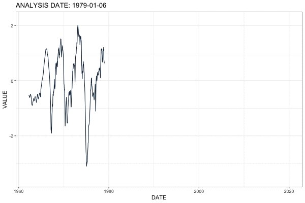
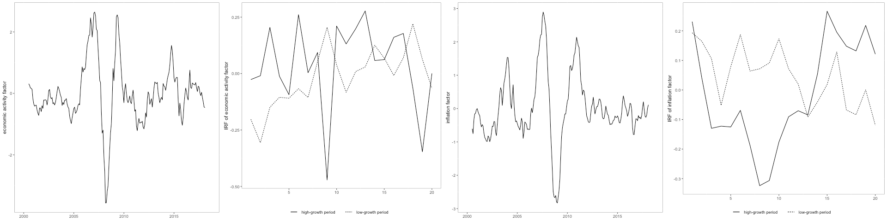

```{r setup, include=FALSE}
knitr::opts_chunk$set(echo = TRUE)
```

### Nowcasting Business Cycle Phases with High and Mixed Frequency Data



- Developed a novel real-time dataset of macroeconomic variables at quarterly, monthly, weekly, and daily frequencies from April 1962 to May 2020. 

- Modeled the economic activity at daily intervals using a mixed-frequency dynamic factor model, and extracted the optimal latent economic activity factor with Kalman filter and smoother.

- Measured the probability of recessions in real-time using a variety of supervised machine learning classifiers. 

- Proposed a procedure to convert probabilities of recessions into a binary variable that defines whether the economy is in an expansion or a recession regime on a daily basis.

**Result**: the use of higher frequency data significantly improves the speed at which expansions and recessions can be identified in the U.S. since 1980. While The National Bureau of Economic Research (NBER) announced on June 8, 2020, that a new recession started in the U.S. in March 2020, my model identified the start of this recession on March 15, 2020, 85 days ahead of the NBER announcement.

_Click here for the recent revisions of this project._


### A New High Frequency, News Based, Indicator of Macroeconomic Activity


- Collected a large sample of lead paragraphs of 410,601 articles published in The Wall Street Journal and The Wall Street Journal Online in the United States from April 2, 1991, to April 30, 2020, that have subjects related to economic activity.

- Proposed a procedure to pre-process the raw text as a manageable high-dimensional numerical array, including tokenization, removing stopword, stemming, and reversing negation words.

- Applied dictionary methods to develop a weekly and monthly News-Based Sentiment Index (NBSI) regarding economic conditions.

- Assessed the validity of this developed NBSI by tracking a wide range of monthly macroeconomic activity measures. 

- Estimated the usefulness of NBSI in identifying U.S. expansions and recessions in real-time. 

_Click here for the recent revisions of this project._

### Is Response of Economic Output to Monetary Policy Asymmetric in China?

- Collected 34 monthly fundamental series that correlate with output and price in China.

- Pre-processed data to remove effects of the Lunar New Year, adjust for seasonality, impute missing values by an iterative expectation-maximization algorithm, and remove a local mean from each series using a biweight kernel. 

- Extracted the latent economic activity factor and inflation factor from underlying variables with the first principal component using a dynamic factor model.

- Measured structural shocks of monetary policy from Choleski decomposition of residuals from a Factor Augmented Vector Autoregression (FAVAR) model.

- As in Tenreyro & Thwaites (2016), I measured probabilities of the unobservable states of the economy being in high-growth & low-growth states using a smooth transition logistic function, and estimated impulse response functions (IRF) of the economic activity factor and inflation factor using local projections methods. 

**Result**: the monetary policy shock has larger impacts on output growth during low-growth states and that monetary policy shock has larger impacts on aggregate price during high-growth states.



_Click here for the recent revisions of this project._
