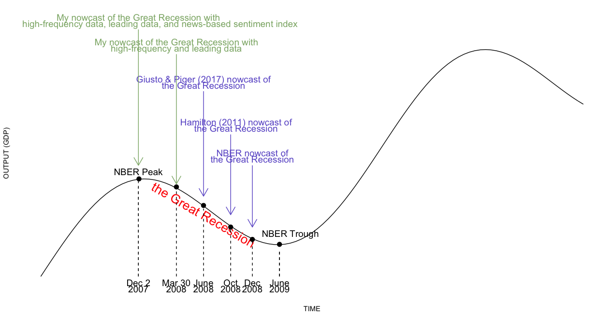

```{r setup, include=FALSE}
knitr::opts_chunk$set(echo = TRUE)
```

<div style="margin-bottom:50px;">
</div>

<div style="margin-bottom:50px;">
</div>

### Nowcasting Business Cycle Phases with High-Frequency Data (Job Market Paper)

**Motivation:** Real-time tracking of the present state of macroeconomic activity, particularly for tracking recessions, is of great interest to firms, workers, financial market participants, and policymakers. Despite significant research focus on forecasting and nowcasting macroeconomic activity, there are still substantial delays in identifying key macroeconomic fluctuations. For example, the 2007-2009 Great Recession was not identified until mid-to-late 2008 by statistical tracking models in real-time, and the National Bureau of Economic Research (NBER) did not announce this recession until December 1, 2008. In this paper, I develop novel datasets and evaluate techniques for improved high-frequency monitoring of the macroeconomy. 

**Method**: I developed a novel real-time dataset of macroeconomic data at quarterly, monthly, weekly, and daily frequencies from April 1962 to August 2020. I modeled and extracted the latent economic activity factor at daily intervals using a mixed-frequency dynamic factor model with a Kalman filter. I measured the probability of recessions in real time using a supervised Markov regime-switching classifier and a Hamilton filter. I then proposed a dating procedure to convert probabilities of recessions into a binary variable that defines whether the economy is in an expansion or a recession regime on a daily basis.

**Result**: the use of higher-frequency data, leading data, and information from economic news articles significantly and consistently improves the speed at which expansions and recessions can be identified in the United States since 1980. As representative examples, with high-frequency and leading data included into the analysis, my model identifies the 2007-2009 Great Recession on March 30, 2008, 246 days ahead of the NBER announcement and many months ahead of the statistical procedures surveyed in Hamilton (2011). When I further incorporate a news-based sentiment index developed in another of my project, Li (2020), my model identifies the Great Recession even earlier, on December 2, 2007. During the Covid-19 pandemic, the NBER announced on June 8, 2020 that a new recession has started in the United States since March 2020; however, my model identified this recession on March 22, 2020, 78 days ahead of the NBER announcement.

<!-- In several cases, business cycle turning points are called prior to -->
<!-- their occurring, which demonstrates the value-added of incorporating leading data into the analysis.  -->

<!-- while the National Bureau of Economic Research (NBER) announced on December 1, 2008, that a new recession, "the Great Recession", started in January 2008, my model identified the start of this recession on December 23, 2007, 256 days ahead of the NBER announcement.   -->

<br>

<center>

</center>

<br>

_This animation shows the estimated economic activity factor on selected analysis dates from the January 6, 1979 through August 31, 2020. Shaded areas indicate U.S. recessions. The factor starts to drop at the beginning of recessions, suggesting that the extracted factor captures the the movement of economic activity correctly and quickly._


<center>

</center>

<br>

_As a representative example, incorporating high-frequency and leading data produces a call of the December 2007 business cycle peak on March 30, 2008, which is 246 days ahead of the NBER announcement, and many months ahead of the statistical procedures surveyed in Hamilton (2011). Further incorporating information from the news allows the model to identify this peak even earlier, on December 2, 2007._

**Click [here](files/Xiang-Ivy-Li_JobMarketPaper.pdf) for the most recent version of this project (Nov 2020)**

**Click [here](files/Dec2020.html) for presentation slides (Dec 2020)**


<div style="margin-bottom:50px;">
</div>


### A New High Frequency, News Based, Indicator of Macroeconomic Activity (Preliminary and Incomplete)

**Motivation:** The information encoded in the text has been recently used in empirical economics research as a complement to the more structured macroeconomic and financial data traditionally used. Text selected from news, social media, reports, and speeches contains “soft” information missing in the quantifiable variables. Unlike most of the headline macroeconomic data that are published at a relatively low frequency and for which past observation periods are revised as more accurate estimates become available, text such as news articles arrives daily and is not revised. These advantages make data extracted from text an ideal candidate to build more accurate nowcasting models about aggregate economic activity in real-time.

**Method:** In this paper, I collected a large sample of lead paragraphs of news articles published in the United States from April 2, 1991, to August 31, 2020, that have subjects related to economic activity. I proposed a procedure to pre-process the raw text as a manageable high-dimensional numerical array, including tokenization, removing stopwords, stemming, and reversing negation words. I apply dictionary methods to develop a daily News-Based Sentiment Index regarding economic conditions. 

**Preliminary Results:** The index drops sharply before the start of the recessions in the sample period, suggesting that the index is a leading indicator with respect to recessions and might be used to nowcast or even forecast recessions.

<!-- I am able to identify the December 2007 business cycle peak on December 2, 2007, 365 days ahead of the NBER announcement and many months ahead of the statistical procedures surveyed in Hamilton (2011).  -->

<!-- I assessed the validity of this developed NBSI by tracking a wide range of monthly macroeconomic activity measures, and estimated the usefulness of NBSI in identifying U.S. expansions and recessions in real-time.  -->

<br>

<center>

</center>

<br>

_This animation shows the change of the most frequently used negative and positive words in news articles over years._


<br>

<center>

</center>

<br>

_This figure shows the movement between the monthly NBSI and monthly macroeconomic variables from April 1991 to April 2020. Monthly macroeconomic variables used here include the unemployment rate, total nonfarm payroll employment, industrial production, real manufacturing and industries sales, and the University of Michigan consumer sentiment index. The figure suggests that NBSI correctly captures the movement in these economic activity variables._


**Click [here](files/CHAPTER4.pdf) for the most recent version of this project (August 2020)**

**Click [here](files/CH4-SLIDE.html) for presentation slides (May 2020)**


<div style="margin-bottom:50px;">
</div>

### Is the Response of Economic Output to Monetary Policy Asymmetric in China?

**Motivation:** Since 2000, China’s economic growth has been very strong. It is now the second-largest economic engine in the world measured by nominal GDP, and the world’s largest economy by purchasing power parity, contributing 27 percent of global GDP in 2018. Despite this importance, there has been relatively little work done on understanding the effects of Chinese monetary policy. In this paper, I investigate how monetary policy instruments affect output growth and inflation, and whether this effect is asymmetric in high-growth periods vs. low-growth periods.

**Method:** I collected 34 monthly fundamental series that correlate with output and price in China. I pre-processed data to remove effects of the Lunar New Year, adjust for seasonality, impute missing values by an iterative expectation-maximization algorithm, and remove a local mean from each series using a biweight kernel. I extracted the latent economic activity factor and inflation factor from underlying variables with the first principal component using a dynamic factor model. I measured structural shocks of monetary policy from Choleski decomposition of residuals from a factor augmented vector autoregression model. As in Tenreyro & Thwaites (2016), I measured probabilities of the unobservable states of the economy being in high-growth & low-growth states using a smooth transition logistic function, and estimated impulse response functions of the economic activity factor and inflation factor using local projections methods. 

**Result**: the monetary policy shock has larger impacts on output growth during low-growth states and the monetary policy shock has larger impacts on inflation rate during high-growth states. My paper is the first to study asymmetric effects of monetary policy on the Chinese economy over the business cycle.

<br>

<center>

</center>

<br>

_The top figures in this panel present the economic activity factor and the inflation factor in China. The persistent decline in the economic activity growth and inflation during the late 2008 is aligned with the U.S. Great recession and the global financial crisis. The bottom figures in this panel present the impulse response function of the economic activity factor and inflation factor to a one percentage point increase in the identified monetary policy shock. The evidence shows that monetary policy is more powerful in impacting economic activity during low-growth states, and monetary policy is more powerful in impacting inflation during high-growth states._

**Click [here](files/CHAPTER2.pdf) for the most recent version of this project (August 2020)**

**Click [here](files/CH2-SLIDE.html) for presentation slides (May 2020)**


