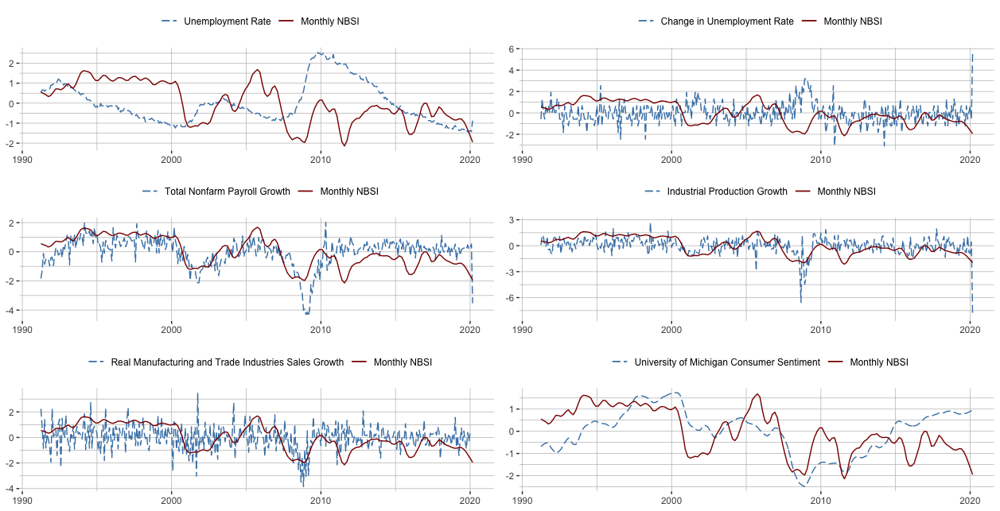

```{r setup, include=FALSE}
knitr::opts_chunk$set(echo = TRUE)
```

<div style="margin-bottom:50px;">
</div>

<div style="margin-bottom:50px;">
</div>

### Nowcasting Business Cycle Phases with High and Mixed Frequency Data

**Motivation:** Real time tracking of the present state of macroeconomic activity, particularly for tracking recessions in real time, is of great interest to firms, workers, financial market participants and policy makers. Despite significant research focus on forecasting and nowcasting macroeconomic
activity, there are still substantial delays in identifying key macroeconomic fluctuations. For example, the December 2007 peak of the Great Recession was not identified until mid-to-late 2008 by statistical tracking models in real time. In this paper, the dominant theme is evaluating techniques and developing novel datasets for improved high frequency monitoring of the macroeconomy. 

**Method**: In this paper, I developed a novel real-time dataset of macroeconomic variables at quarterly, monthly, weekly, and daily frequencies from April 1962 to May 2020. I modeled the economic activity at daily intervals using a mixed-frequency dynamic factor model, and extracted the optimal latent economic activity factor with Kalman filter and smoother. I measured the probability of recessions in real-time using a variety of supervised machine learning classifiers. I also proposed a procedure to convert probabilities of recessions into a binary variable that defines whether the economy is in an expansion or a recession regime on a daily basis.

**Result**: the use of higher frequency data significantly and consistenly improves the speed at which expansions and recessions can be identified in the U.S. since 1980. As a representative example, while the National Bureau of Economic Research (NBER) announced on June 8, 2020 that a new recession started in the U.S. in March 2020, my model identified the start of this recession on March 15, 2020, 85 days ahead of the NBER announcement.

<br>

<center>

</center>

<br>

_This animation shows the estimated economic activity factor on selected analysis dates from the January 6, 1979 and April 30, 2020. Shaded areas indicate U.S. recessions. The factor starts to drop at the beginning of recessions, suggesting that the extracted factor captures the the movement of economic activity correctly and quickly._


_Click [here](files/CHAPTER3.pdf) for the most recent version of this project (August 2020)_

_Click [here](files/CH3-SLIDE.html) for presentation slides (May 2020)_


<div style="margin-bottom:50px;">
</div>


### A New High Frequency, News Based, Indicator of Macroeconomic Activity (Preliminary and Incomplete)

**Motivation:** The information encoded in text has been recently used in empirical economics research as a complement to the more structured macroeconomic and financial data traditionally used. Text selected from news, social media, reports and speeches contains “soft” information missing in the quantifiable variables. Unlike most of the headline macroeconomic data that are published at a relatively low frequency and for which past observation periods are revised as more accurate estimates become available, text such as news articles arrives daily and is not revised. These advantages make data extracted from text an ideal candidate to build more accurate nowcasting models about aggregate economic activity in real time.

**Method:** In this paper, I collected a large sample of lead paragraphs of 410,601 articles published in The Wall Street Journal and The Wall Street Journal Online in the United States from April 2, 1991, to April 30, 2020, that have subjects related to economic activity. I proposed a procedure to pre-process the raw text as a manageable high-dimensional numerical array, including tokenization, removing stopword, stemming, and reversing negation words. I applied dictionary methods to develop a weekly and monthly News-Based Sentiment Index (NBSI) regarding economic conditions. 

**Preliminary result:** The index drops sharply before the start of the recessions in the sample period, suggesting that the index might be a leading indicator with respect to recessions and might be used to nowcast or even
forecast recessions. 

<!-- I assessed the validity of this developed NBSI by tracking a wide range of monthly macroeconomic activity measures, and estimated the usefulness of NBSI in identifying U.S. expansions and recessions in real-time.  -->


<br>

<center>

</center>

<br>

_This figure shows the movement between the monthly NBSI and monthly macroeconomic variables from April 1991 to April 2020. Monthly macroeconomic variables I use include unemployment rate, total nonfarm payroll, industrial production, real manufacturing and industries sales, and University of Michigan consumer sentiment index. The figure suggests that NBSI correctly captures the movement of the economic activity._

_Click [here](files/CHAPTER4.pdf) for the most recent version of this project (August 2020)_

_Click [here](files/CH4-SLIDE.html) for presentation slides (May 2020)_


<div style="margin-bottom:50px;">
</div>

### Is Response of Economic Output to Monetary Policy Asymmetric in China?

**Motivation:** Since 2000, China’s economic growth has been very strong. It is now the second largest economic engine in the world measured by nominal GDP, and the world’s largest economy by purchasing power parity, contributing 27 percent of global GDP in 2018. Despite this importance, there has been relatively little work done on understanding the effects of Chinese monetary policy. In this paper, I investigate how monetary policy instruments affect output growth and inflation, and whether this effect is asymmetric across different states of output growth.

**Method:** In this paper, I collected 34 monthly fundamental series that correlate with output and price in China. I pre-processed data to remove effects of the Lunar New Year, adjust for seasonality, impute missing values by an iterative expectation-maximization algorithm, and remove a local mean from each series using a biweight kernel. I extracted the latent economic activity factor and inflation factor from underlying variables with the first principal component using a dynamic factor model. I measured structural shocks of monetary policy from Choleski decomposition of residuals from a Factor Augmented Vector Autoregression (FAVAR) model. As in Tenreyro & Thwaites (2016), I measured probabilities of the unobservable states of the economy being in high-growth & low-growth states using a smooth transition logistic function, and estimated impulse response functions (IRF) of the economic activity factor and inflation factor using local projections methods. 

**Result**: the monetary policy shock has larger impacts on output growth during low-growth states and that monetary policy shock has larger impacts on aggregate price during high-growth states.

<br>

<center>

</center>

<br>

_The top figures in this panel present the economic activity factor and the inflation factor in China. The persistent decline in the economic activity growth and inflation during the late 2008 is aligned with the U.S. Great recession and the global financial crisis. The bottom figures in this panel present the impulse response function of the economic activity factor and inflation factor to a one percentage point increase in the identified monetary policy shock. The evidence shows that monetary policy is more powerful in impacting economic activity during low-growth states, and monetary policy is more powerful in impacting inflation during high-growth states._

_Click [here](files/CHAPTER2.pdf) for the most recent version of this project (August 2020)_

_Click [here](files/CH2-SLIDE.html) for presentation slides (May 2020)_


