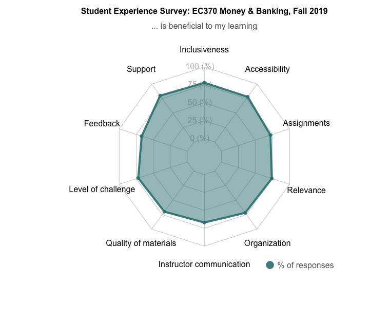

```{r setup, include=FALSE}
knitr::opts_chunk$set(echo = TRUE)
```

## Teaching Philosophy

As an Instructor of Record at the University of Oregon, I work closely with students to help them achieve personal academic goals and organize graduate employee grading. Entering Fall 2020, I have taught solely and assisted in teaching 4 undergraduate classes a total of 8 times, in person and online. Enrollment ranges from small groups of 16 students to large classes of 85 students. 

As an educator in economics, I aim to create an inclusive environment where students are able to apply quantitative & graphical skills, economic intuition, and economic theory to understand the evolving real-world issues, news, and events. I pride myself in helping students with developing economic tools to problem solve and being available to assist students outside of class whenever the need arises. 





## Courses as Instructor of Record:

- **EC 370: Money and Banking**: Summer 2018, Winter 2019, Fall 2019, Spring 2020 (remote), Spring 2021 (forthcoming)

- **EC 311: Intermediate Macroeconomic Theory**: Summer 2019

Course materials (syllabus, lecture slides, practice problems, and study guide) written in R markdown are shared  in my Github repos:
- [EC 370](https://github.com/lx0413/EC370)
- [EC 313](https://github.com/lx0413/EC313)


## Courses as Lab Teaching Assistant: 

- **EC 320: Introduction to Econometrics**: Spring 2019

- **EC 202 : Intro to Economic Analysis: Macroeconomics**: Spring 2017, Winter 2018

As lab teaching assistant, I taught students how to use Stata to analyze data and identify causal relationships. I also led discussion and organized group activities. 


## Student Comments: 

_"Worked hard to make sure students understood the material. Made it evident that she cares and wants students to be successful. Was very reachable outside of the classroom. ... Powerpoints were put together well. In-class problems correlated well with exam materials. Quizzes were good indicators of how well students know the chapter." -- Taylor Athan_

_"Honestly, this instructor is one of my favorite instructor so far. She's so kind and when we have a quiz to midterm, she told us lots of details that we should focus on. Her class is interesting and I really like it." -- Pengfei Qin_

_"Xiang does a great job helping students understand course material. She also shares cool information that helps students learn more about the topic, such as interesting economics podcasts. ... I think the course was really well organized. It was very helpful to have weekly practice problems which kind of served as optional homework, to help students practice course material. That helped me a lot with remembering things learned." -- Marie Rose Tonguino_

_"The course itself is structured well. Xiang provided us with many practice problems which helped with mastering the course material. ... Xiang is a great professor who is very organized and utilizes class time well." -- Ashvin Ashoke_

_"Xiang did a great job of being clear about what was required for this course. Her lectures were informative." -- Tyler Hanson_

_"Professor Li was very good at getting through a lot of material in each class period." -- Sean Vermilya_

_Instructor was helpful in clarifying course material (during office hours) on various occasions. She was accessible, approachable, and seemed passionate about her students' success._

_Xiang Li was very supportive and understanding when emergency issues arose during the quarter. She was very helpful in explaining what was expected of the students._

_I have never had a teacher as on top of posting Canvas as this class. Did an excellent job in communicating assignments and posting them quickly after class._